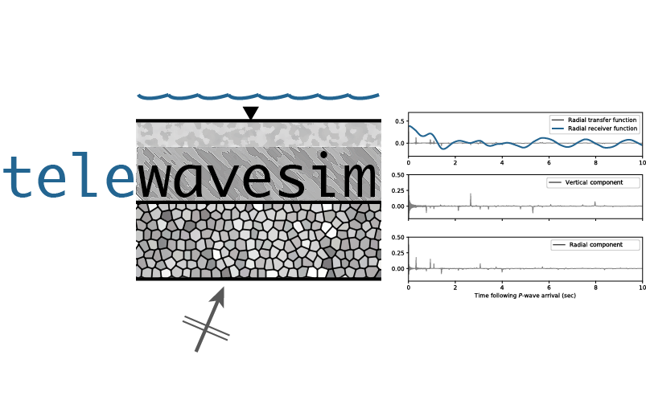

# Telewavesim: Software for teleseismic body wave modeling

The structure of the Earth's crust and upper mantle gives useful information on the
internal composition and dynamics of our planet. Some of the most widely used techniques
to infer these properties are based on examining the effect of teleseismic body wave
(i.e., P and S waves that originate from distant earthquakes and arrive as plane waves)
propagation (e.g., transmission and scattering) through stratified media. Modeling the
seismic response from stacks of subsurface layers is therefore an essential tool in
characterizing their effect on observed seismograms.

This package contains `python` and `fortran` modules to synthesize teleseismic
body-wave propagation through stacks of generally anisotropic and strictly horizontal
layers using the matrix propagator approach of [Kennett (1983)](#references), as implemented
in [Thomson (1997)](#references).
The software also properly models reverberations from an overlying column of water using the R/T
matrix expressions of [Bostock and Trehu (2012)](#references),
effectively simulating ocean-bottom seismic (OBS) station recordings. The software
will be useful in a variety of teleseismic receiver-based studies, such as P or S
receiver functions, long-period P-wave polarization, shear-wave splitting from
core-refracted shear waves (i.e., SKS, SKKS), etc. It may also be the starting point
for stochastic inverse methods (e.g., Monte Carlo sampling). The main part of the
code is written in `fortran` with `python` wrappers. Common computational
workflows are covered in the Jupyter notebooks bundled with this package.

Installation, Usage, API documentation and Jupyter Notebooks are described at https://paudetseis.github.io/Telewavesim/

#### Contribute

All contributions are welcome, e.g. report bugs, discuss or add new features. For example, the package could profit from including more elastic constants or additional noteboobs that describe published examples of teleseismic body-wave modeling. Suggestions for improvements (speed, accuracy, etc.) are also welcome.

#### References

- Bostock, M.G., and Trehu, A.M. (2012). Wave-field decomposition of ocean-bottom seismograms. Bulletin of the Seismological Society of America, 102, 1681-1692. https://doi.org/10.1785/0120110162

- Kennett, B.L.N. (1983). Seismic wave propagation in stratified media. Cambridge University Press, 342pp. https://www.oapen.org/search?identifier=459524

- Thomson, C.J. (1997). Modelling surface waves in anisotropic structures: I. Theory. Physics of the Earth and Planetary interiors, 103, 195-206. https://doi.org/10.1016/S0031-9201(97)00033-2
